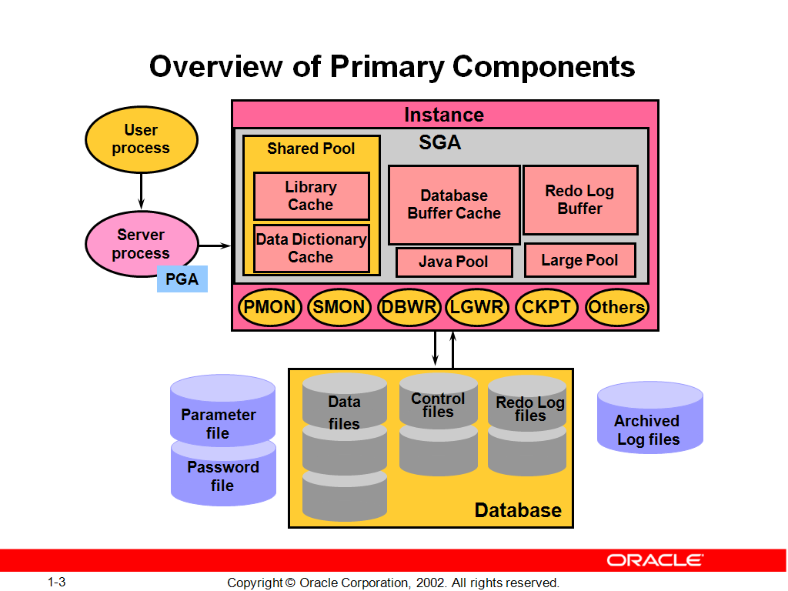

# 第一章：实例与数据库

## Oracle 基础架构及应用环境

### Oracle Server的基本结构
* oracle server：database + instance
* database：data file、control file、redolog file
* instance: an instance access a database
* oracle memory: sga + pga
* instance：sga + backgroud process

### 系统全局区SGA
* 在一个instance只有一个sga
* sga为所有session共享，随着instance启动而分配
* instance down ，sga被释放

## SGA的基本组件:
### shared pool
* 共享池是对SQL、PL/SQL程序进行语法分析、编译、执行的内存区域。
* 共享池由库缓存（library cache）,和数据字典缓存（data dictionary cache）以及结果缓存（result cache）等组成。
* 共享池的大小直接影响数据库的性能。

关于shared pool中的几个概念
* library cache：
  sql和plsql的解析场所，存放着所有编译过的sql语句代码，以备所有用户共享
* data dictionary cache：
  存放重要的数据字典信息，以备数数据库使用
* server result cache：
  存放服务器端的SQL结果集及PL/SQL函数返回值
* User Global Area (UGA)：
  共享服务器连接模式下如果没有配置large pool，则UGA属于SGA的shared pool， 专用连接模式时UGA属于PGA

### database buffer cache（PPT-II-328）
* 用于存储从磁盘数据文件中读入的数据，为所有用户共享。
* 服务器进程（server process)负责将数据文件的数据从磁盘读入到数据缓冲区中，当后续的请求需要这些数据时如果在内存中找到，则不需要再从磁盘读取。
* 数据缓冲区中被修改的数据块（脏块）由后台进程DBWR将其写入磁盘。
* 数据缓冲区的大小对数据库的读取速度有直接的影响。

要弄明白Database Buffer Cache中的几个cache概念：
* Buffer pool=(default pool)+(nodefault pool)

  * default pool（参数db_cache_size）是标准块存放的内存空间大小，SGA自动管理时此参数不用设置。使用LRU算法清理空间
  * nodefault pool：对应的参数有
    * db_nk_cache_size   指定非标准块大小内存空间，比如2k、4k、16k、32k。
    * db_keep_cache_size   存放经常访问的小表或索引等。
    * db_recycle_cache_size   与keep相反，存放偶尔做全表扫描的大表的数据。
  * 如何指定使用某个表调入nodefault pool
SQL> alter table scott.emp1 storage(buffer_pool keep);
SQL>
select segment_name,buffer_pool from dba_segments where segment_name='EMP1';
  * default pool对应的参数是db_cache_size与标准块default block是配套的，如果default block是8k, db_cache_size这个参数将代替db_8k_cache_size。
  * 如果要建立非标准块的表空间，先前要设定db buffer中的与之对应的db_nk_cache_size参数。
第一步，先指定db buffer里的16k cache空间大小。
SQL> alter system set db_16k_cache_size=8m;
第二步，建立非标准块表空间
SQL> create tablespace tbs_16k datafile '/u01/oradata/prod/tbs16k01.dbf' size 10m blocksize 16k;
SQL> select TABLESPACE_NAME,block_size from dba_tablespaces;

### redo log buffer
日志条目（redo entries）记录了数据库的所有修改信息(包括DML和DDL），目的是为数据库恢复，日志条目首先产生于日志缓冲区，日志缓冲区较小，一般缺省值在3M-15M之间，它是以字节为单位的。

日志缓冲区的大小启动后就是固定不变的，如要调整只能通过修改参数文件后重新启动生效。不能动态修改！不能由SGA自动管理！

### large pool（可选）
为了进行大的后台进程操作而分配的内存空间，主要用于共享服务器的session memory（UGA），RMAN备份恢复以及并行查询等操作。有助于降低shared pool碎片。

### java pool(可选）
为了java虚拟机及应用而分配的内存空间，包含所有session指定的JAVA代码和数据。

### stream pool（可选）
为了stream process而分配的内存空间。stream技术是为了在不同数据库之间共享数据，因此，它只对使用了stream数据库特性的系统是重要的。
