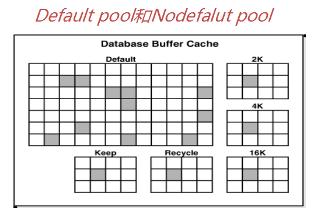
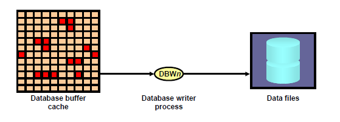
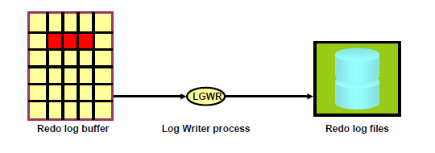
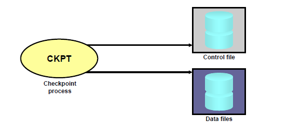
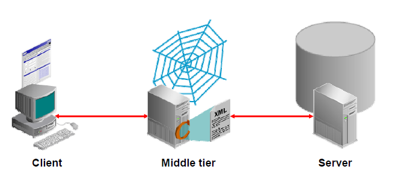
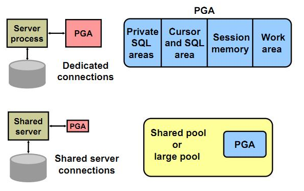
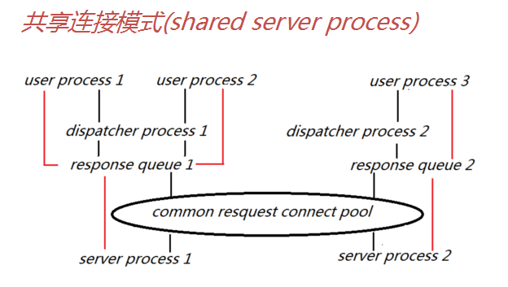

# 第一章：实例与数据库

## Oracle 基础架构及应用环境


### Oracle Server的基本结构
* oracle server：database + instance
* database：data file、control file、redolog file
* instance: an instance access a database
* oracle memory: sga + pga
* instance：sga + backgroud process

### 系统全局区SGA
* 在一个instance只有一个sga
* sga为所有session共享，随着instance启动而分配
* instance down ，sga被释放


## SGA的基本组件:
### shared pool
* 共享池是对SQL、PL/SQL程序进行语法分析、编译、执行的内存区域。
* 共享池由库缓存（library cache）,和数据字典缓存（data dictionary cache）以及结果缓存（result cache）等组成。
* 共享池的大小直接影响数据库的性能。

关于shared pool中的几个概念
* library cache：
  sql和plsql的解析场所，存放着所有编译过的sql语句代码，以备所有用户共享
* data dictionary cache：
  存放重要的数据字典信息，以备数数据库使用
* server result cache：
  存放服务器端的SQL结果集及PL/SQL函数返回值
* User Global Area (UGA)：
  共享服务器连接模式下如果没有配置large pool，则UGA属于SGA的shared pool， 专用连接模式时UGA属于PGA


### database buffer cache（PPT-II-328）
* 用于存储从磁盘数据文件中读入的数据，为所有用户共享。
* 服务器进程（server process)负责将数据文件的数据从磁盘读入到数据缓冲区中，当后续的请求需要这些数据时如果在内存中找到，则不需要再从磁盘读取。
* 数据缓冲区中被修改的数据块（脏块）由后台进程DBWR将其写入磁盘。
* 数据缓冲区的大小对数据库的读取速度有直接的影响。

要弄明白Database Buffer Cache中的几个cache概念：
* Buffer pool=(default pool)+(nodefault pool)

* default pool（参数db_cache_size）是标准块存放的内存空间大小，SGA自动管理时此参数不用设置。使用LRU算法清理空间
* nodefault pool：对应的参数有
  * db_nk_cache_size   指定非标准块大小内存空间，比如2k、4k、16k、32k。
  * db_keep_cache_size   存放经常访问的小表或索引等。
  * db_recycle_cache_size   与keep相反，存放偶尔做全表扫描的大表的数据。
* 如何指定使用某个表调入nodefault pool
  ```
  SQL> alter table scott.emp1 storage(buffer_pool keep);
  SQL>select segment_name,buffer_pool from dba_segments where segment_name='EMP1';
  ```
* default pool对应的参数是db_cache_size与标准块default block是配套的，如果default block是8k, db_cache_size这个参数将代替db_8k_cache_size。
* 如果要建立非标准块的表空间，先前要设定db buffer中的与之对应的db_nk_cache_size参数。

  第一步，先指定db buffer里的16k cache空间大小。
    ```
    SQL> alter system set db_16k_cache_size=8m;
    ```
  第二步，建立非标准块表空间
    ```
    SQL> create tablespace tbs_16k datafile '/u01/oradata/prod/tbs16k01.dbf' size 10m blocksize 16k;
    SQL> select TABLESPACE_NAME,block_size from dba_tablespaces;
    ```

### redo log buffer
日志条目（redo entries）记录了数据库的所有修改信息(包括DML和DDL），目的是为数据库恢复，日志条目首先产生于日志缓冲区，日志缓冲区较小，一般缺省值在3M-15M之间，它是以字节为单位的。

日志缓冲区的大小启动后就是固定不变的，如要调整只能通过修改参数文件后重新启动生效。不能动态修改！不能由SGA自动管理！

### large pool（可选）
为了进行大的后台进程操作而分配的内存空间，主要用于共享服务器的session memory（UGA），RMAN备份恢复以及并行查询等操作。有助于降低shared pool碎片。

### java pool(可选）
为了java虚拟机及应用而分配的内存空间，包含所有session指定的JAVA代码和数据。

### stream pool（可选）
为了stream process而分配的内存空间。stream技术是为了在不同数据库之间共享数据，因此，它只对使用了stream数据库特性的系统是重要的。


## Oracle 的进程
### user process
客户端的 process，访问数据库分为三种形式：1 sql*plus；2 应用程序；3 web方式（EM）
* sql*plus 可以执行sql和plsql请求，是典型的客户端进程。
  * linux 作为客户端：可以使用ps看到sqlplus关键字：
   ```
   $ps -ef | grep sqlplus
   ```
  * windows 作为客户端：可以通过查询任务管理器看到sqlplus用户进程
  ```
  $sqlplus sys/system@ as sysdba
  ```
* 应用程序：
  例如：通过java程序直接嵌套sql语句，或调用Oracle存储过程。
* web方式：
  例如：通过OEM登陆、管理数据库
  ```
  $emctl start dbconsole
  ```
### server process
服务器端的进程，user process 不能直接访问Oracle，必须通过相应的 server process 访问实例，进而访问数据库。
```
$ps -ef | grep LOCAL
```
在linux下看到的server process，（LOCAL=YES）是本地连接，（LOCAL=NO）是远程连接。

可以在oracle查看V$process视图，它包括了当前所有的后台进程和服务器进程。
```
SQL>select pid, program, background from v$process;
```
background 字段为 1 是 background process，其余都是 server process

### background process
基本的后台进程有
* smon：系统监控进程
  * 当实例崩溃之后，Oracle会自动恢复实例。
  * 释放不再使用的临时段。
* pmon：进程监控
  * 当 user process 失败时，清理出现故障的进程。释放所有当前挂起的锁定。释放服务器端使用的资源
  * 监控空闲会话是否到达阀值
  * 动态注册监听
* dbwn：数据写入进程

  * 将变更的数据缓冲区的脏buffer写入数据文件中。
  * 释放数据缓冲区空间
  * 触发条件：
    * ckpt发出
    * 脏块太多时（阈值）
    * db_buffer自由空间不够时
    * 3秒
    * 表空间 read only/offline/backup 模式等

    以上5 个状况之一发生时，dbwn 都会被触发
* lgwr：写日志条目

  * 将日志缓冲区中的日志条目写入日志文件。
  * 不像DBWR可以有多个进程并行工作，LGWR只有一个进程
  * 触发条件：
    * commit
    * 三分之一满（或1M满）
    * 先于dbwr写（先记后写，必须在dbwr写脏块之前写入日志，保证未提交数据都能回滚）
    * 3秒（因为有3，则由DBWR的3秒传导而来）

    以上4个状况之一发生时，lgwr都会记日志
* ckpt：生成检查点

作用：通知或督促dbwr写脏块
  * 完全检查点：保证数据库的一致性。
  * 增量检查点：不断更新控制文件中的检查点位置，当发生实例崩溃时，可以尽量缩短实例恢复的时间。
  * 局部检查点：特定的操作下，针对某个表空间的
* arcn：归档当前日志。归档模式下，发生日志切换时，把当前日志组中的内容写入归档日志，作为备份历史日志提供数据库的recovrey

## PGA 的基本组件
### 程序全局区（Program Global Area）的作用
* 缓存来自服务器进程和后台进程的数据和控制信息。
* 提供排序、hash 连接
* 不提供 session 之间的共享
* PGA 在进程创建时被分配，进程终止时被释放。所有进程的 PGA 之和构成了 PGA 的大小。
PGA 的管理是比较复杂的，10g后，Oracle 推荐使用PGA 自动管理，屏蔽了 PGA 的复杂性。

### PGA 的结构

* SQL 工作区（SQL Work Area）：有几个子区
  * Sort Area
  * Harh Area
  * Bitmap Merge Area

  作用：排序操作（order by/group by/distinct/union等），多表hash连接，位图连接，创建位图

* 会话空间（Session Memory）

  作用：存放logon信息等会话相关的控制信息

* 私有SQL区域（Private SQL Area）

  作用：存储 server process 执行SQL所需要的私有数据和控制结构，如绑定变量，它包括固定区域和运行时区域

* 游标区域（Cursor Area）

  PLSQL 游标使用的就是这块区域


## 连接方式

### 专用连接模式（dedicated）
对于客户端的每个 user process，服务器端都会出现一个 server process，会话与专用服务器之间存在一对一的映射（一根绳上的两个蚂蚱）。
专用连接的 PGA 的管理方式是私有的。Oracle缺省采用专用连接模式。


### 共享连接模式（shared）

多个user process 共享一个 server process。
* 共享服务器实际上就是一种连接池机制（connectionpooling），连接池可以重用已有的超时连接，服务于其它活动会话，但容易产生锁等待。此种连接方式现在已经很少见了（具体配置方法见第十五章Oracle网络）。
* 所有调度进程（dispatcher）共享一个公共的请求队列（request queue），但是每个调度进程都有与自己响应的队列（response queue）。
* 在共享服务器中会话的（UGA）存储信息是在 SGA 中的，而不像专用连接那样在 PGA 中存储信息，这时的 PGA 的存储结构为堆栈空间。

### 驻留连接池模式（database resident connection pooling，简称 DRCP）：
适用于必须维持数据库的永久连接。结合了专有服务器模式和共享服务器模式的特点。它使用连接代理（而不是专有服务器）连接客户机到数据库，优点是可以用很少的内存处理大量并发连接（11g新特性，特别适用于 Apache 的 PHP 应用环境）。
