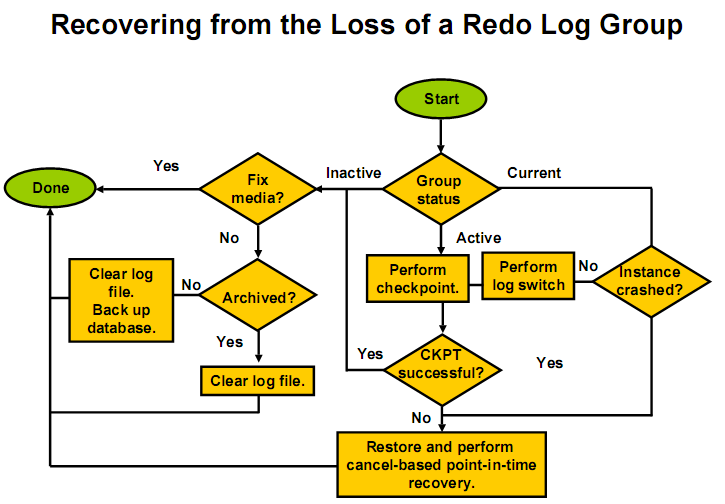
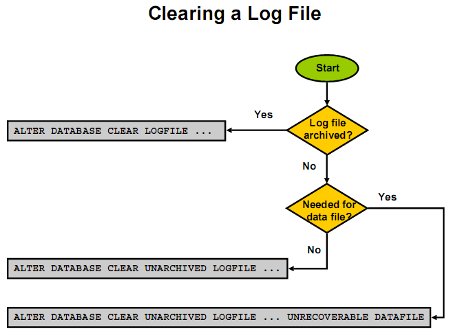

# redo 日志

## 作用和特征

### 作用

数据 recovery

### 体征

* 记录数据库的变化（DML，DDL）
* 用于数据块的 recover
* 以组的方式管理 redo file，最少两组 redo，循环使用
* 和数据文件放到不同的磁盘上，需读写速度快的磁盘（比如采用 RAID10）
* 日志的 block 和数据文件的 block 不是一回事

```
SQL>select max(lebsz) from x$kccle;
MAX(LEBSZ)
----------
      512
```


## 日志组及切换

* 最少两组，最好每组有两个成员（多路复用），并存放到不同的磁盘上，大小形同，互相镜像
* 日志在组写满时将自动切换
  * 归档模式：将历史日志连续的进行保存
  * 非归档：历史日志被覆盖
  * 切换产生 checkpoint （考虑性能有延迟），通知 dbwn 写脏块，并且更新控制文件
* 在归档模式，日志进行归档，并把相关的信息写入 controlfile


## 添加日志组和成员

### 三个重要视图

```
SQL> select * from v$log;

    GROUP#    THREAD#  SEQUENCE#      BYTES  BLOCKSIZE    MEMBERS ARCHIVED STATUS           FIRST_CHANGE# FIRST_TIME  NEXT_CHANGE# NEXT_TIME
---------- ---------- ---------- ---------- ---------- ---------- -------- ---------------- ------------- ----------- ------------ -----------
         1          1         10   52428800        512          1 NO       CURRENT                 918551 2017/2/28 2 281474976710
         2          1          8   52428800        512          1 NO       INACTIVE                883120 2017/1/22 1       889928 2017/2/4 20
         3          1          9   52428800        512          1 NO       INACTIVE                889928 2017/2/4 20       918551 2017/2/28 2

SQL> select * from v$logfile;

    GROUP# STATUS  TYPE    MEMBER                                                                           IS_RECOVERY_DEST_FILE
---------- ------- ------- -------------------------------------------------------------------------------- ---------------------
         3         ONLINE  /app/oradata/orcl/redo03.log                                                     NO
         2         ONLINE  /app/oradata/orcl/redo02.log                                                     NO
         1         ONLINE  /app/oradata/orcl/redo01.log                                                     NO

SQL> select * from v$archived_log;

     RECID      STAMP NAME                                                                                DEST_ID    THREAD#  SEQUENCE# RESETLOGS_CHANGE# RESETLOGS_TIME RESETLOGS_ID FIRST_CHANGE# FIRST_TIME  NEXT_CHANGE# NEXT_TIME       BLOCKS BLOCK_SIZE CREATOR REGISTRAR STANDBY_DEST ARCHIVED APPLIED   DELETED STATUS COMPLETION_TIME DICTIONARY_BEGIN DICTIONARY_END END_OF_REDO BACKUP_COUNT ARCHIVAL_THREAD# ACTIVATION# IS_RECOVERY_DEST_FILE COMPRESSED FAL END_OF_REDO_TYPE BACKED_BY_VSS
---------- ---------- -------------------------------------------------------------------------------- ---------- ---------- ---------- ----------------- -------------- ------------ ------------- ----------- ------------ ----------- ---------- ---------- ------- --------- ------------ -------- --------- ------- ------ --------------- ---------------- -------------- ----------- ------------ ---------------- ----------- --------------------- ---------- --- ---------------- -------------

```


### 增加一个组 group4

```
SQL> alter database add logfile group 4 '/app/oradata/orcl/redo04.log' size 50m;

Database altered

SQL> select * from v$logfile;

    GROUP# STATUS  TYPE    MEMBER                                                                           IS_RECOVERY_DEST_FILE
---------- ------- ------- -------------------------------------------------------------------------------- ---------------------
         3         ONLINE  /app/oradata/orcl/redo03.log                                                     NO
         2         ONLINE  /app/oradata/orcl/redo02.log                                                     NO
         1         ONLINE  /app/oradata/orcl/redo01.log                                                     NO
         4         ONLINE  /app/oradata/orcl/redo04.log                                                     NO
```

### 添加日志组的成员

为每个组添加一个 member （一共是 4 个组）
先建好目录，准备放在/home/oracle/oradata/orcl

```
$mkdir -p /home/oracle/oradata/orcl

SQL> alter database add logfile member
  2  '/home/oracle/oradata/orcl/redo01.log' to group 1,
  3  '/home/oracle/oradata/orcl/redo02.log' to group 2,
  4  '/home/oracle/oradata/orcl/redo03.log' to group 3,
  5  '/home/oracle/oradata/orcl/redo04.log' to group 4;

Database altered

SQL> select * from v$logfile;

    GROUP# STATUS  TYPE    MEMBER                                                                           IS_RECOVERY_DEST_FILE
---------- ------- ------- -------------------------------------------------------------------------------- ---------------------
         3         ONLINE  /app/oradata/orcl/redo03.log                                                     NO
         2         ONLINE  /app/oradata/orcl/redo02.log                                                     NO
         1         ONLINE  /app/oradata/orcl/redo01.log                                                     NO
         4         ONLINE  /app/oradata/orcl/redo04.log                                                     NO
         1 INVALID ONLINE  /home/oracle/oradata/orcl/redo01.log                                             NO
         2 INVALID ONLINE  /home/oracle/oradata/orcl/redo02.log                                             NO
         3 INVALID ONLINE  /home/oracle/oradata/orcl/redo03.log                                             NO
         4 INVALID ONLINE  /home/oracle/oradata/orcl/redo04.log                                             NO

8 rows selected

SQL>
```

STATUS 是 INVALID，说明 member 还没有同步好

```
SQL>alter system switch logfile; // 至少做 4 次切换，消除 INVALID ，这步是很必要
```

### v$log 视图的状态

* STATUS 列有四种状态
  * unused：新添加的日志组，还没有使用
  * inactive：日志组对应的脏块已经从 data buffer 写入到 data file，可以覆盖
  * active：日志组对应的脏块还没有完全从 data buffer 写入到 data file ，含有实例恢复需要的信息，不能覆盖
  * current：当前日志组对应的脏块还没有全部从 data buffer 写入 data file，含有实例恢复需要的信息，不能被覆盖
* THREAD：线程在单实例的环境下，THREAD# 永远是 1
* SEQUENCE#：日志序列号，在日志切换时会递增
* FIRST_CHANGE#：在每个日志组对应一个 SEQUENCE 号，其中首条日志条目的第一个 scn


### 日志恢复





#### inactive 日志组损坏

假如日志组 4 损坏，状态 inaction，解决很简单，重建日志组即可

```
SQL>ALTER database clear logfile group 4; -- 这里 clear 的意思是重建 group4 的文件
```

#### current 日志组丢失

本例日志组 1 状态是 current 状态的，现在模拟当前日志组损坏

```
$rm /u01/oradata/prod/redo01.log
SQL>alter system switch logfile; -- 切换几次，触动它一下
```

告警日志会记录有关信息，暂时好像没有什么问题发生，继续切换，当 current 又转会到 group1 时，session 死！

当前日志损坏的问题比较复杂，见上图可以分以下几种情况讨论

1. 数据库没有崩溃
  第一步，可以做一个完全检查点，将 db buffer 中的所有 dirty buffer 全部刷新到磁盘
 
 ```
 SQL>alter system checkpoint;
 ```
  
  第二步，尝试数据库在打开状态下进行不做归档的强制清除
  
  ```
  SQL>alter database clear unarchived logfile group n;
  ```
  
  数据库此时为打开状态，这步若能成功，一定要做一个新的数据库全备，因为当前日志无法归档，归档日志 sequence
  已无法保持连续性，全备的目的就是甩掉之前的归档日志
  
2. 数据库已经崩溃，只能做传统的基于日志的不完全恢复或使用闪回数据库

  ```
  SQL>recover database until cancel;
  SQL>alter database open resetlogs;
  ```

3. 如果之前没有可用的备份，或问题严重到任何方法都不能 resetlogs 打开数据库，为了抢救数据，
考虑最后一招使用 Oracle 的隐含参数：``_allow_resetlogs_corruption=TRUE``

  Oracle 不推荐使用这个隐含参数，该参数的含义是：允许数据库在不一致性的情况下强制打开数据库
  
#### active 日志组损坏

做检查点切换，如成功，按照 inactive 损坏处理，否则，按照 current 损坏处理


### 使日志恢复到原来的配置

1. 删除日志组

```
SQL>alter database drop logfile group 4; -- 状态是 current 和 active 的组不能删除
```

2. 删除成员

```
SQL>alter database drop logfile member 'u01/disk2/prod/redo01.log'; -- 状态是 current 组不能删除成员，需要切换一下 
```

3. 清理物理日志文件 删除物理文件需要 rm
