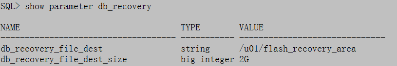

# 归档日志archivelog

## 归档和非归档得区别

* 归档会在日志切换时，备份历史日志，对于 OLTP 系统都应考虑归档模式，以便数据库能支持热备，
并提供数据库完全恢复和不完全恢复（基于时间点）
* 归档会启用 arcn 的后台进程、也会占用磁盘空间
* 非归档适用某种静态库、测试库、或者可由远程提供数据恢复的数据库。非归档只能冷备，且仅能还原
最后一次全备。

## 设置归档模式

```
SQL>shutdown immediate    -- 一定要干净的关闭数据库
SQL>startup mount   -- 启动到 mount 下
SQL>alter database archivelog;  -- 设置归档方式
SQL>archive log list;   -- 查看归档状态
SQL>alter database open;    -- 打开数据库
```

## 路径及命名方法


**Oracle 判断归档目的地时按如下顺序优先择取**

    * log_archive_dest_n 值或 log_archive_dest 值
    * db_recover_file_dest 参数指定的位置
    * $ORACLE_HOME/dbs 参数指定的位置

**路径可以通过 archive log list 命令显示**


Archive destination（存档终点）有两种情形
* 缺省是 USE_DB_RECOVERY_FILE_DEST，其含义是采用参数 db_recovery_file_dest 参数
的定义，即闪回恢复区
* 采用参数 log_archive_dest_n 或 log_archive_dest 指定的路径

```
SQL>show parameter archive
NAME                                  TYPE        VALUE
------------------------------------ ----------- --------------------------------------
archive_lag_target                   integer     0
log_archive_config                   string
log_archive_dest                     string
log_archive_dest_1                   string      location=/u01/arch/prod
log_archive_dest_10                  string
log_archive_dest_2                   string
log_archive_dest_3 
... 
log_archive_duplex_dest              string
log_archive_format                   string      arch_%t_%r_%s.log

```

```
SQL>show parameter db_recovery
```



**首先来看这两个参数**

* log_archive_dest_n
* log_archive_format
* log_archive_dest_n (n:1-10) 表示可以有 10 个目标路径存放归档日志（镜像关系），
即可以多路复用 10 个归档日志的备份，如上显示我只使用了 log_archive_dest_1，也就是说只有一套归档日志，
没有做镜像，参数设定的格式如下：

```
SQL>alter system set log_archive_dest_1='location=/u01/arch/prod';
```
把历史日志归档到本机目录下（location 代表本机）

```
SQL>alter system set log_archive_dest_2='service=standby';
```

log_archive_format 是定义命名格式的，一般考虑使用下面三个内置符号（模板）
* %t thread# 日志线程号
* %s sequence 日志序列号
* %r resetlog 代表数据库的周期
参数设定的格式如下：

```
SQL>alter system set log_archive_format='arch_%t_%r_%s.log' scope=spfile;
```

**再来看看这两个参数**

log_archive_dest, log_archive_duplex_dest 这两个参数已经弃用了，它们能完成两路
复用（镜像）但只能指定本机 location，一旦使用 log_archive_dest_n, log_archive_dest
 参数就失效了

## 归档进程和手动切换

**归档进程**

```
$ps -ef | grep ora_arc
oracle    1215  2435  0 13:26 pts/2    00:00:00 grep ora_arc
oracle   31796     1  0 13:00 ?        00:00:00 ora_arc0_
oracle   31798     1  0 13:00 ?        00:00:00 ora_arc1_
```

ARCn 就是归档进程，n 最多可达 30 个，由 log_archive_max_processes 参数指定

**手动切换日志**

```
SQL>alter system switch logfile;
```
仅切换当前实例，使用归档和非归档

```
SQL>alter system archive log current;
```
在 RAC 下切换所有实例，仅使用于归档模式

