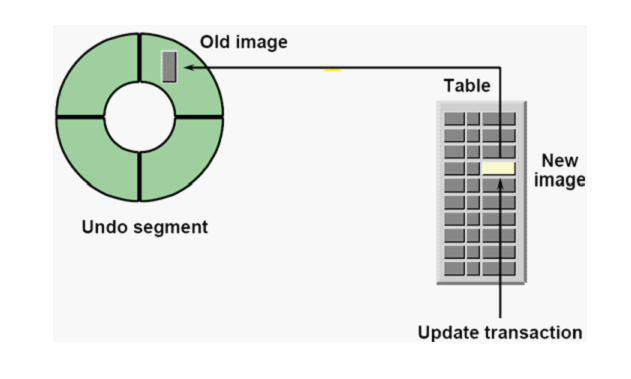
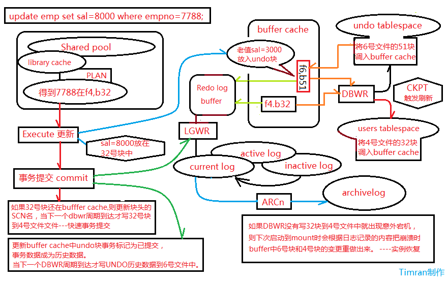

# 管理 undo

## Undo 作用

使用 undo tablespace 存放从数据缓存区读出的数据块的前镜像



提供以下四种情况所需要的信息

    1. 回滚事务：rollback
    2. 读一致性：正在做 DML 操作的数据块，事务结束前，其他用户读 undo 里面的数据前镜像
    3. 实例的恢复：instance recover(undo->rollback)
    4. 闪回技术：flashback query、flashback table 等




## Undo 的参数

**三个基本参数**

```
SQL>show parameter undo
NAME                          TYPE        VALUE
------------------------------------ ----------- ------------------------------
undo_management               string      AUTO
undo_retention                integer     900
undo_tablespace               string      UNDOTBS1
```

**参数说明**

    1. undo_management：manaual 仅在维护时使用，auto 使用 undo tablespace 管理 undo
    2. undo_retention：指定保留期，希望在这个期间 commit 的 undo 数据不要覆盖
    3. undo_tablespace：当前使用的 Undo 表空间

**建立一个 undo 表空间**

可以建立多个 undo 表空间，但只有一个是使用中的 undo 使用中的 undo tablespace 不能 offline 和 drop


建立一个新的 undo 表空间

```
SQL>create undo tablespace undotbs2 datafile '/u01/oradata/prod/undotbs02.dbf' size 50m autoextend on;
```

查看 undo tablespace

```
SQL>select tablespace_name, status, contents from dba_tablespaces;
```

查看当前正在使用的 undo tablespace 回滚段

```
SQL>select * from v$rollname;
USN        NAME
---------- ------------------------------
         0 SYSTEM
         1 _SYSSMU1_1363316212$
         2 _SYSSMU2_1363316212$
         3 _SYSSMU3_1363316212$
         4 _SYSSMU4_1363316212$
         5 _SYSSMU5_1363316212$
         6 _SYSSMU6_1363316212$
         7 _SYSSMU7_1363316212$
         8 _SYSSMU8_1363316212$
         9 _SYSSMU9_1363316212$
        10 _SYSSMU10_1363316212$
```

**切换 undo**

动态参数，修改立即生效
```
SQL>alter system set undo_tablespace=undotbs2;
SQL>select * from v$rollname;
USN        NAME
---------- ------------------------------
         0 SYSTEM
        11 _SYSSMU11_1357956213$
        12 _SYSSMU12_1357956213$
        13 _SYSSMU13_1357956213$
        14 _SYSSMU14_1357956213$
        15 _SYSSMU15_1357956213$
        16 _SYSSMU16_1357956213$
        17 _SYSSMU17_1357956213$
        18 _SYSSMU18_1357956213$
        19 _SYSSMU19_1357956213$
        20 _SYSSMU20_1357956213$
```

删除未激活 undo
```
SQL>drop tablespace undotbs1 including contents and datafiles;
```


## Undo 空间重用机制

Undo 数据的 4 种状态

    * active：表示 transaction 还没有 commit，不可覆盖
    * unexpired：由已经 commit 或 rollback 的数据转换而来的状态，在保留期内，尽量不覆盖（非强制）
    * expired：由 unexpired 转换而来，其中的数据是超过 undo 保留期的，随时可以再分配（覆盖）
    * free：分配了但未使用过，一般是 undo 最初创建和扩展时出现，它不是一个常态的

undo 的状态转换体现了 undo 空间的循环使用原理：分配--》冻结--》回收--》再分配

## 关于 AUM

**什么是 AUM**

Oracle10gR2 以后引入了一个新的自动调整 undo retention 的特性，目的是尽量避免两个 Undo 错误

    * ora-30036 错误--空间不足
    * ora-01555 错误--快照太旧

11g 缺省设置为 AUM（Auto Undo Management），AUM 下 current undo retention 是自动调整的

```
SQL>select begin_time, tuned_undoretention from v$undostat;
BEGIN_TIME          TUNED_UNDORETENTION
------------------- -------------------
2015-10-11 20:17:20                1784
2015-10-11 20:07:20                1723
2015-10-11 19:57:20                1119
```

**AUM 的两种工作方式**

    1. autoextend off 下，忽略 undo_retention 参数，TUNED_UNDORETENTION
    参照 undo 表空间大小和统计信息，缺点：空间给定不合理时，产生 UNDO 告警，不能完全
    避免 ora-30036，ora-01555，若 UNDO 增加尺寸，又可能造成 TUNED_UNDORETENTION 增加
    2. autoextend on 下，参考 undo_retention 作为下限值，TUNED_UNDORETENTION 期内，
    以扩展空间代替覆盖 unexpired，基本避免 ora-30036，ora-01555，缺点：表空间可能过度膨胀


**关闭 AUM 模式（Oracle 不推荐）**

如果要关闭 undo 自动调优，可以使用隐含参数，_audo_autotune=false

**Undo 的 guarantee 属性**

通常情况下，unexpired 数据并不绝对保证在 retention 期内不会覆盖，必要时可考虑设置在保留期
强制不覆盖的 guarantee 属性，同时应该使 undo autoextend on

```
SQL>select tablespace_name, status, contents, retention from dba_tablespaces;
```

缺省配置下 undo retention 是 noguarantee，guarantee 属性可以修改

```
SQL>alter tablespace undotbs2 retention guarantee;
SQL>alter tablespace undotbs2 retention unguarantee;
```


**undo 信息的查询**

    * v$session：查看用户建立的 session
    * v$transaction：当前的事务
    * v$rollname：undo 段的名称
    * v$rollstat：undo 段的状态
    * v$undostat：查看每 10 分钟的统计数据
    * dba_undo_extents：查看 undo 段种不同状态的空间占用
    * dba_rollback_segs：数据字典里记录的 undo 段状态


