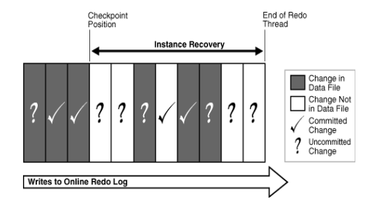
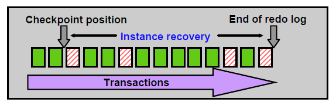
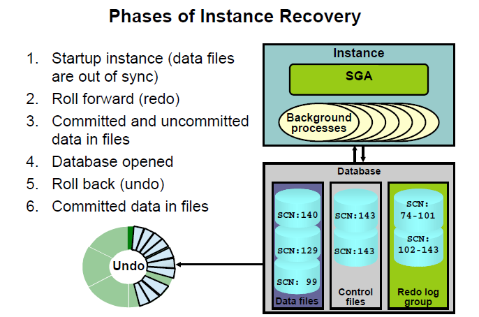

# 实例恢复机制

## 什么是实例恢复

有了 redo，undo 和增量 ckpt 概念后，有助于更好的理解实例恢复

* 背景：当实例崩溃发生时，内存数据丢失，而当时的内存中 db buffe 和磁盘上的datafile 内容不一致
* 要解决两个问题：
  1. 重新构成崩溃时内存中还没有保存到磁盘的已 commit 的变更块
  2. 回滚掉已被写至数据文件的 uncommit 的变更块

## 增量检查点发挥的作用

每个增量检查点触发时，一部分 dirty buffer 被刷新到磁盘，并记录了最后一次检查点位置。
当实例恢复时，Oracle 首先从控制文件里找到最后一次检查点位置，这个位置其实就是实例恢复
时运用日志的起点（RBA）。然后是 smon 监控下的一系列动作

1. roll forward：利用 redo，将检查点位置之后的变更，包括 commit 和 uncommit 的都
前滚出来了，然后统统写到磁盘（datafile）里
2. open：用户可以连接进去，访问数据库
3. roll back：回滚掉数据文件中未提交的数据

